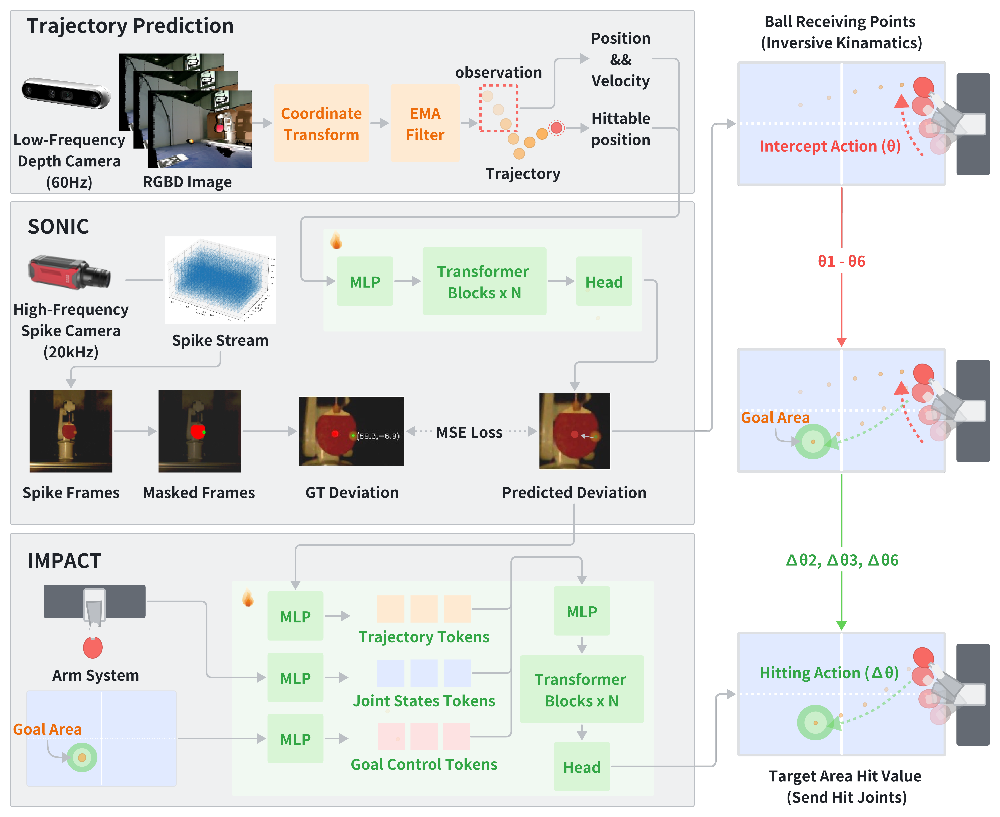

# SpikePingpong: High-Frequency Spike Vision-based Robot Learning for Precise Striking in Table Tennis Game

## Overview

Learning to control high-speed objects in the real world remains a challenging frontier in robotics. Table tennis serves as an ideal testbed for this problem, demanding both rapid interception of fast-moving balls and precise adjustment of their trajectories. This task presents two fundamental challenges: it requires a high-precision vision system capable of accurately predicting ball trajectories, and it necessitates intelligent strategic planning to ensure precise ball placement to target regions. The dynamic nature of table tennis, coupled with its real-time response requirements, makes it particularly well-suited for advancing robotic control capabilities in fast-paced, precision-critical domains.
In this paper, we present SpikePingpong, a novel system that integrates spike-based vision with imitation learning for high-precision robotic table tennis. Our approach introduces two key attempts that directly address the aforementioned challenges: SONIC, a spike camera-based module that achieves millimeter-level precision in ball-racket contact prediction by compensating for real-world uncertainties such as air resistance and friction; and IMPACT, a strategic planning module that enables accurate ball placement to targeted table regions. The system harnesses a 20 kHz spike camera for high-temporal resolution ball tracking, combined with efficient neural network models for real-time trajectory correction and stroke planning.
Experimental results demonstrate that SpikePingpong achieves a remarkable 91\% success rate for 30 cm accuracy target area and 71\% in the more challenging 20 cm accuracy task, surpassing previous state-of-the-art approaches by 38\% and 37\% respectively. These significant performance improvements enable the robust implementation of sophisticated tactical gameplay strategies, providing a new research perspective for robotic control in high-speed dynamic tasks.