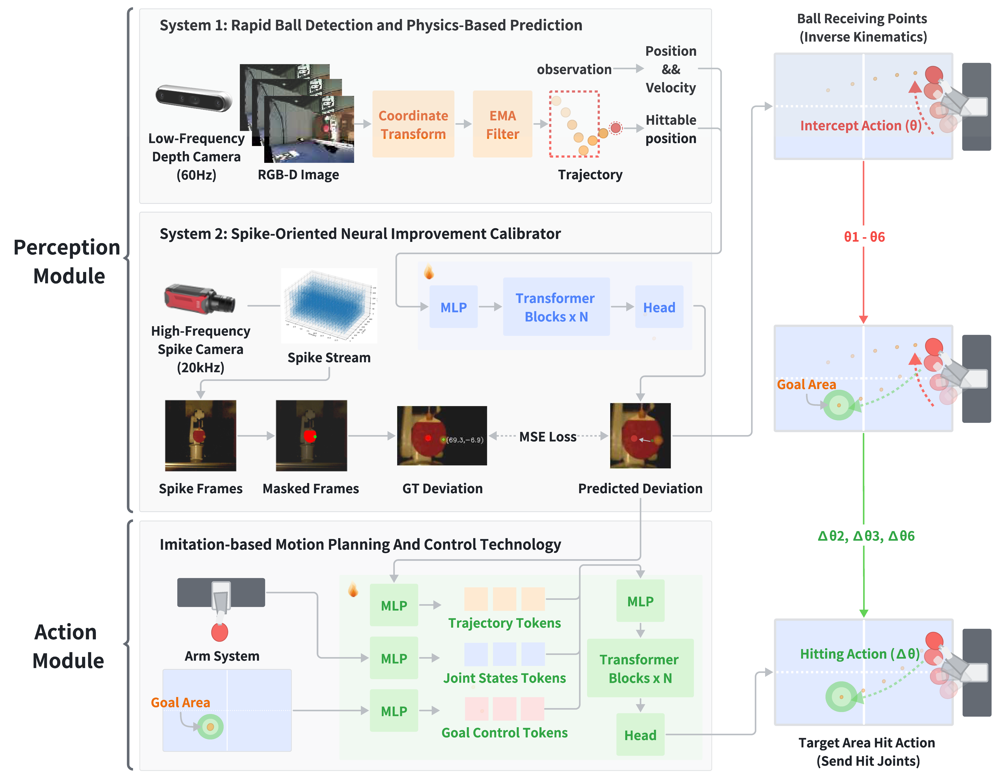

<div align="center">

# 🏓 SpikePingpong: High-Frequency Spike Vision-based Robot Learning for Precise Striking in Table Tennis Game
  
[🌐**Project Page**](https://pkuhaowang.github.io/SpikePingpong/) | [✍️**Paper(Arxiv)**](https://arxiv.org/abs/2506.06690) 

[Hao Wang](https://pkuhaowang.github.io)\*, [Chengkai Hou](https://jackhck.github.io/)\*, [Xianglong Li](https://ieeexplore.ieee.org/author/37089431576)*, [Yankai Fu](https://github.com/AureleoPKU), [Chenxuan Li](https://github.com/2644521362), [Ning Chen](https://github.com/ccdcs), [Gaole Dai](https://scholar.google.com/citations?user=2Of6xZUAAAAJ&hl=en&oi=sra), 

[Jiaming Liu](https://liujiaming1996.github.io/), [Tiejun Huang](https://idm.pku.edu.cn/info/1017/1040.htm), [Shanghang Zhang](https://www.shanghangzhang.com)

</div>



**SpikePingpong** is a novel system that integrates spike-based vision with imitation learning for high-precision robotic table tennis.

## ✨ News ✨
- [2025/06/27] The SpikePingpong code has been officially released! 🎉 Check it out now for detailed implementation and usage.

- [2025/06/07] SpikePingpong is now live on arXiv! 🚀 

## 📦 Installation

<details>
<summary>1. Clone the repository</summary>

```bash
git clone https://github.com/PKUHaoWang/SpikePingpong.git
```

</details>

<details>
<summary>2. Create conda environment with python 3.11</summary>

```bash
conda create -n <env_name> python=3.9
conda activate <env_name>
```

</details>

<details>
<summary>3. Install PyTorch compatible with your CUDA and GPUs</summary>

```bash
# Modify this line according to your CUDA GPUs.
conda install pytorch==2.2.2 torchvision==0.17.2 torchaudio==2.2.2 pytorch-cuda=12.1 -c pytorch -c nvidia
```

</details>

<details>
<summary>4. Install other requirements</summary>

```bash
pip install -r requirements.txt
```

</details>

## 💡Usage Guide
### Training SONIC Module
Preprocess the dataset:
```bash
python sonic/preprocess.py
```

Train the SONIC model:
```bash
python sonic/train.py
```

### Imitation Learning Data Collection
Camera calibration:
```bash
python deployment/aruco_calibrate.py
```

Collect training data:
```bash
python deployment/main_collect.py
```

### Training IMPACT Module
Start training IMPACT
```bash
python impact/train.py
```

### System Deployment
Camera calibration:
```bash
python deployment/aruco_calibrate.py
```

Start the hitting system:
```bash
python deployment/main_deploy.py
```

## 📚 BibTeX 

```bibtex
@article{wang2025spikepingpong,
    title={SpikePingpong: High-Frequency Spike Vision-based Robot Learning for Precise Striking in Table Tennis Game},
    author={Wang, Hao and Hou, Chengkai and Li, Xianglong and Fu, Yankai and Li, Chenxuan and Chen, Ning and Dai, Gaole and Liu, Jiaming and Huang, Tiejun and Zhang, Shanghang},
    journal={arXiv preprint arXiv:2506.06690},
    year={2025}
}
```